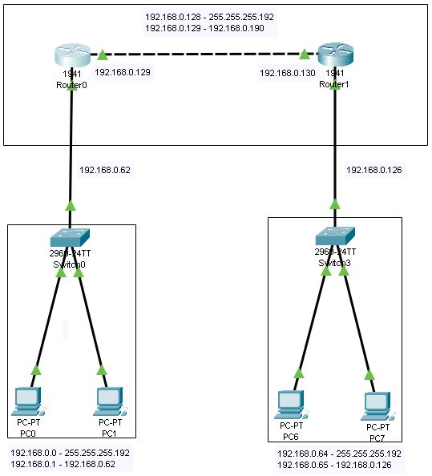
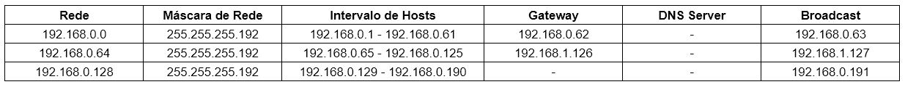

# Projeto de rede utilizando 1 roteador, 2 switchs e 4 PC - CISCO Packet Tracer

## Contextualização

Neste projeto foi feito uma segmentação de rede, em que 2 sub-redes ficaram resposáveis por distribuirem os hosts e 1 sub-rede para a conexão entre os dois roteadores. Cada rede teve sua distribução de hosts feitas através de um switch interno.
Foram introduzidos e aplicados os conceitos de iPv4, Redes, Máscaras de rede, Gateway, Broadcast, PDU, Segmentação de rede e Roteamento Estático.

## Lista dos componentes

- 2 Roteador 1941
- 2 Switchs 2960-24TT
- 4 PC-PT

## Projeto Lógico

## Tabela de endereçamento de IP

## Arquivo pkt

https://drive.google.com/file/d/13hyIxd8Z1-YSdii9pVZO1QHpPlLbVp24/view?usp=sharing
